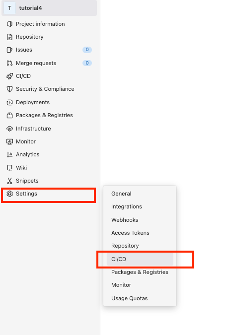
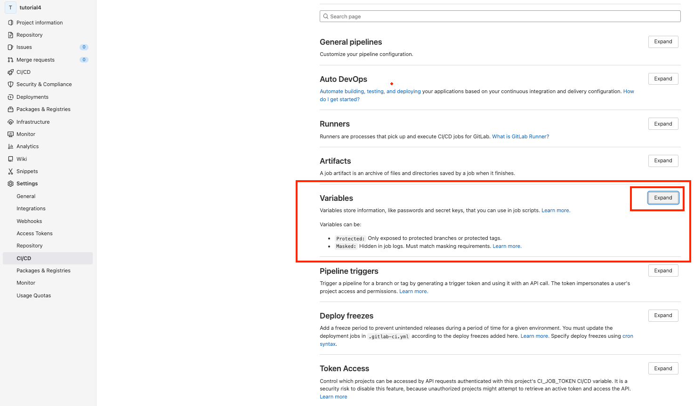
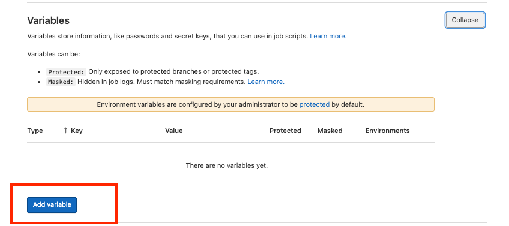
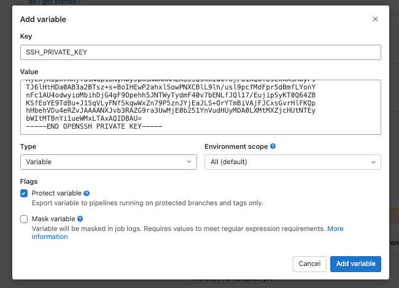

## add key to gitlab

#### Go to gitlab repository environment variables

in gitlab repository, on left menu select settings>CI/CD

in the variables section select "expand"

select "Add Variable"

now name Key: "SSH_PRIVATE_KEY" and paste [your server's key file](../digital_ocean_tutorial/create_and_retrieve_key_on_server.md) file into the Value field

now click "Add Variable"

