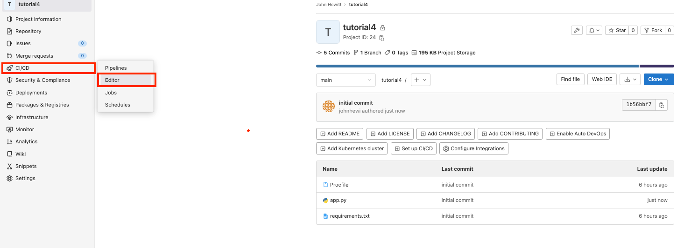
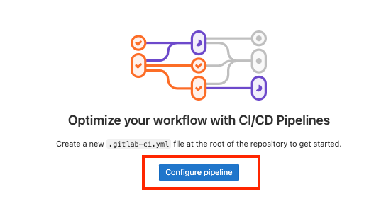
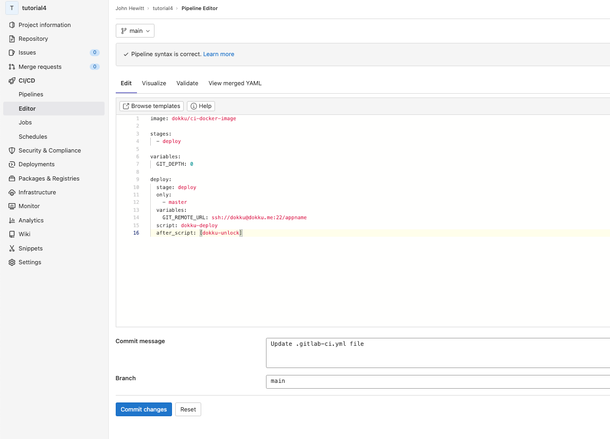
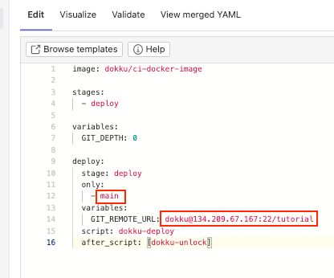
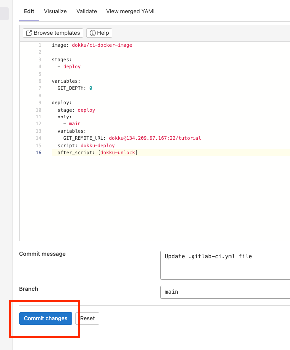

## add a pipeline from gitlab-ci to gitlab repository

from [gitlab-ci](https://github.com/dokku/gitlab-ci/tree/main/example-pipelines) we can get see some free gitlab pipelines
<br></br>
<br></br>

copy the lines of code (without the top line ---) from [simple.yml](https://github.com/dokku/gitlab-ci/blob/main/example-pipelines/simple.yml):
```yaml
image: dokku/ci-docker-image

stages:
  - deploy

variables:
  GIT_DEPTH: 0

deploy:
  stage: deploy
  only:
    - main
  variables:
    GIT_REMOTE_URL: ssh://dokku@dokku.me:22/appname
  script: dokku-deploy
  after_script: [dokku-unlock]
```
<br></br>
<br></br>


in your gitlab repository, on the left select CI/CD > Editor

<br></br>
<br></br>

on the next screen, select "Configure Pipeline"

<br></br>
<br></br>

in the next screen, delete all the prepopulated code and paste the copied code from gitlab-ci

<br></br>
<br></br>


replace "master" in deploy>only with "main":
<br>replace "dokku.me" in deploy>variable: GIT_REMOTE_URL with "dokku@" + your dokku server's ip address:
<br>replace "appname" in deploy>variable: GIT_REMOTE_URL with your dokku app name:

<br>in this example, the server's ip address is 134.209.67.167 and the app name is "tutorial"
the port is left as 22, because that's the default ssh port
<br>the only gitlab repository branch that will be deployed is "main"
<br></br>
<br></br>


click "Commit changes"
!

