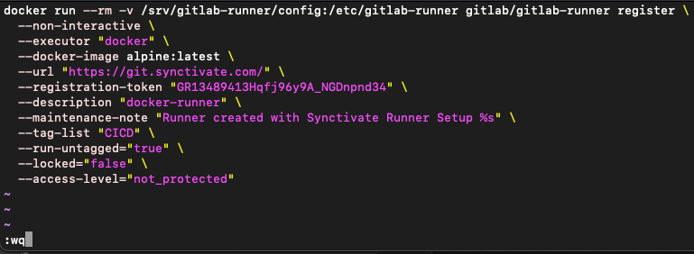
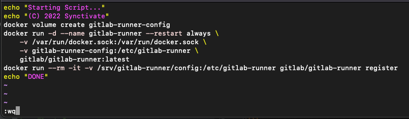

## add runner to server

#### create bash script

logged into the server, create a bash script called `rn.sh`
```bash 
vim rn.sh
```

this opens the vim editor, which looks like this:


while in the vim editor, press `a` to add text, then paste the following code:

change `your-url-here` to your [gitlab url](get_gitlab_url_and_registration_token.md) and `your-token-here` to your [registration token](get_gitlab_url_and_registration_token.md)

```bash
docker run --rm -v /srv/gitlab-runner/config:/etc/gitlab-runner gitlab/gitlab-runner register \
  --non-interactive \
  --executor "docker" \
  --docker-image alpine:latest \
  --url "your-url-here" \  
  --registration-token "your-token-here" \
  --description "docker-runner" \
  --maintenance-note "Runner created with Synctivate Runner Setup %s" \
  --tag-list "CICD" \
  --run-untagged="true" \
  --locked="false" \
  --access-level="not_protected"
```

now press `esc`, then type `:`, then type `wq` and press enter to "*W* rite" the file and "*Q* uit" the vim editor


now run the bash script on the server with the following command:

```bash
bash rn.sh
```
<br></br>
<br></br>

#### create another bash script

logged into the server, create another bash script called `start.sh`
```bash
vim start.sh
```

remember to type `a` to activate insert mode, then paste this code into the script:
```bash 
echo "Starting Script..."
echo "(C) 2022 Synctivate"
docker volume create gitlab-runner-config
docker run -d --name gitlab-runner --restart always \
    -v /var/run/docker.sock:/var/run/docker.sock \
    -v gitlab-runner-config:/etc/gitlab-runner \
    gitlab/gitlab-runner:latest
docker run --rm -it -v /srv/gitlab-runner/config:/etc/gitlab-runner gitlab/gitlab-runner register
echo "DONE"
```


then type `:` then `wq` to save and quit the vim editor


now run the bash script on the server with the following command:

```bash
bash start.sh
```