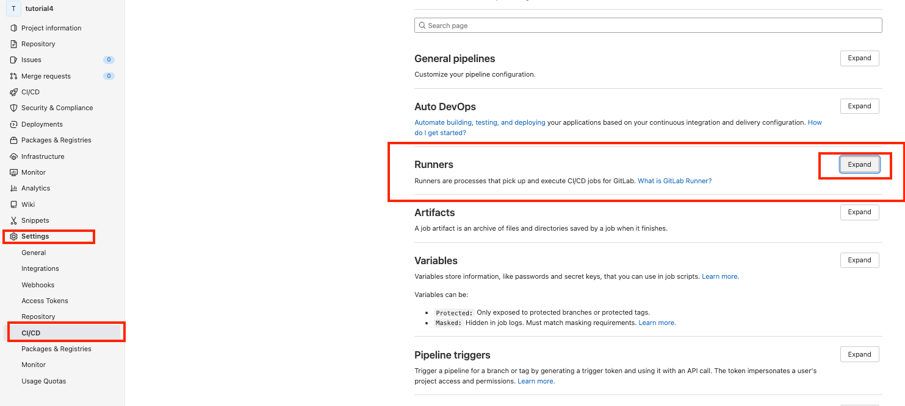
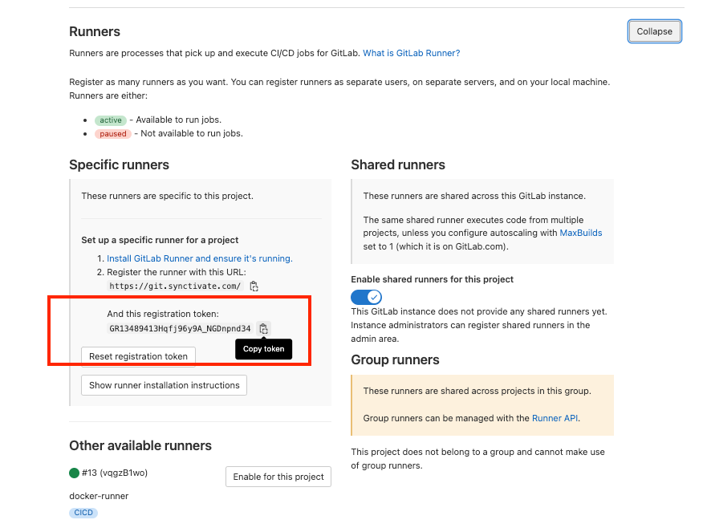
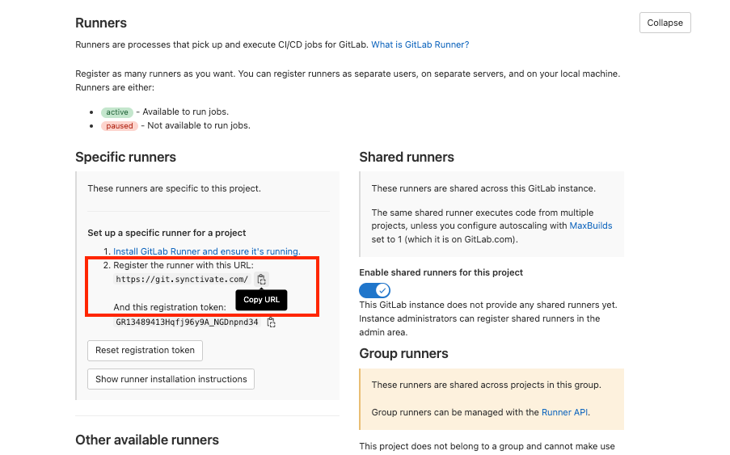

## get gitlab runner url and registration token

#### get registration token from gitlab

in gitlab repository, on left menu select settings>CI/CD>>Runners and click "Expand"

copy the registration token

#### get runner url from gitlab
copy the url
