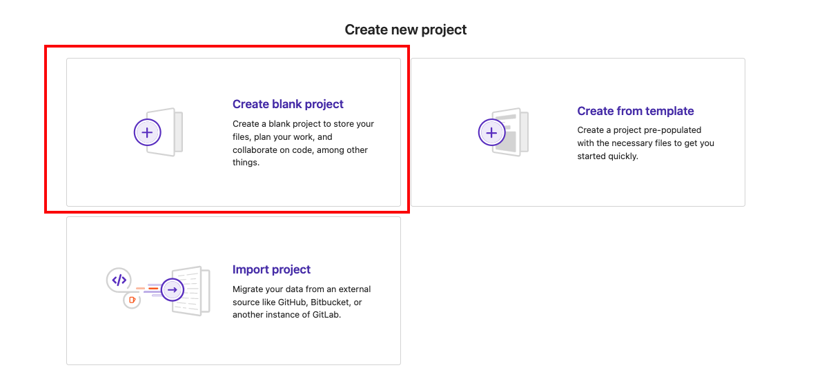
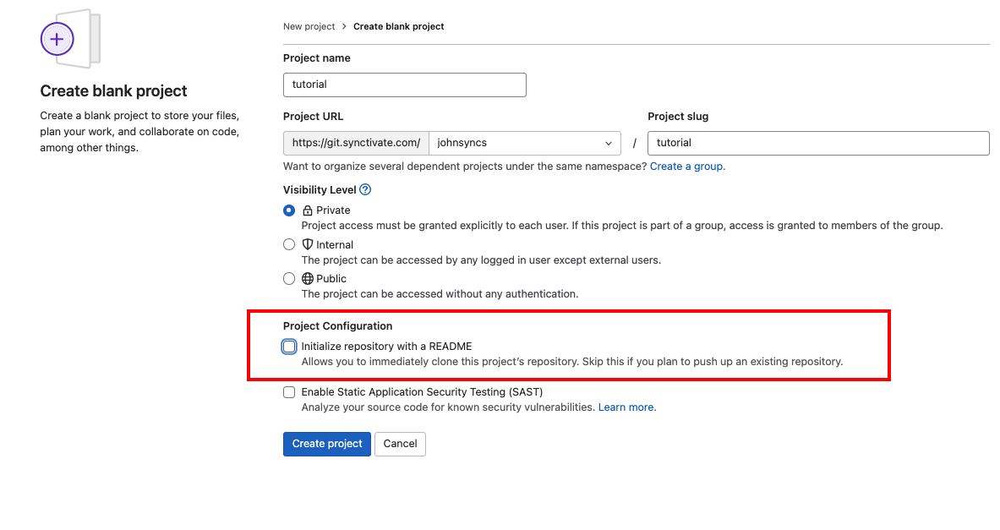
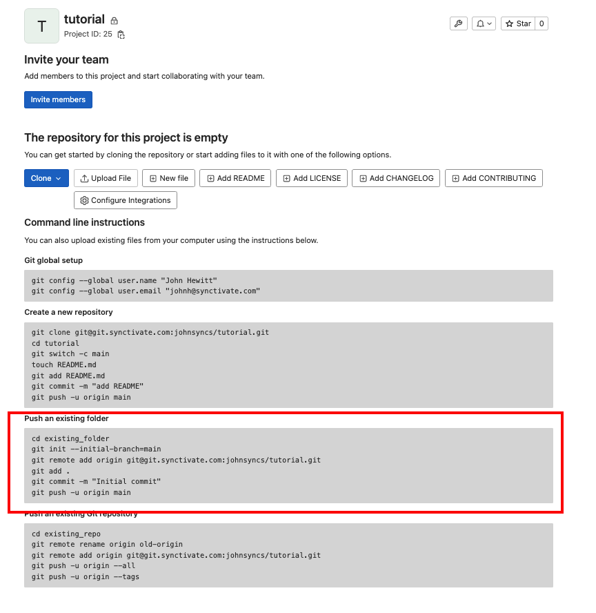

## link your local repository with gitlab repository


#### Create new repository in gitlab

Select "Create Blank Project"



Unckeck "Initialize repository with a README"



After you click "Create project" you will be taken to a page with several sets of Command line instructions

Under the heading "push an existing folder" you should find these commands:



Run these commands in terminal, in local environment

```bash
cd existing_folder
git init --initial-branch=main
git remote add origin [your/project/directory].git
git add .
git commit -m "Initial commit"
git push -u origin main
```
These commands will connect your local environment with the gitlab repository and pushes your local project to the gitlab server. Now when you git push, it pushes to the gitlab repository.
