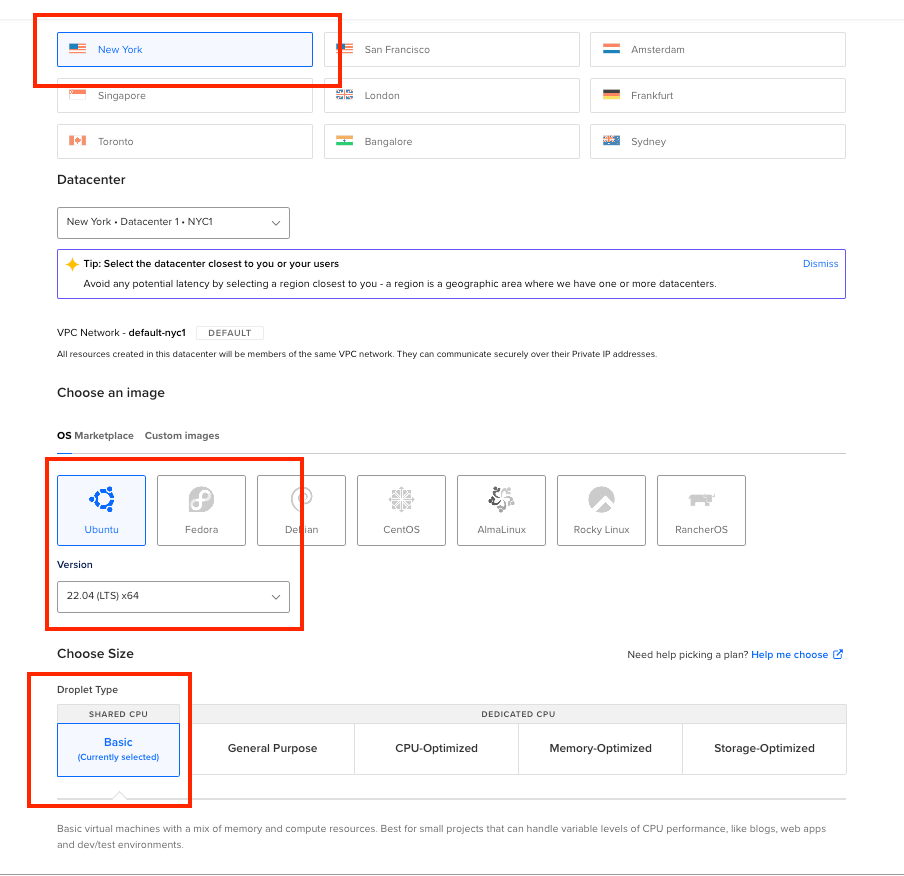
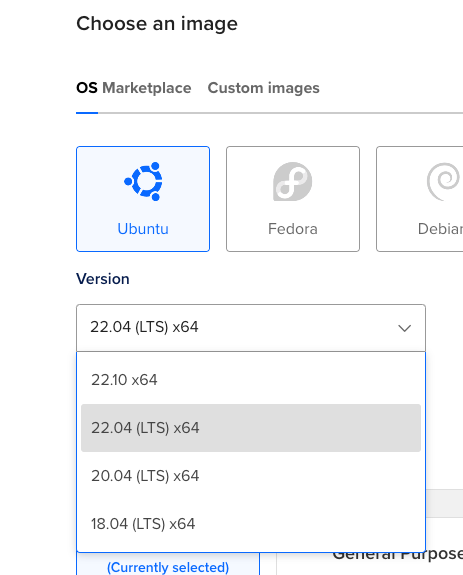
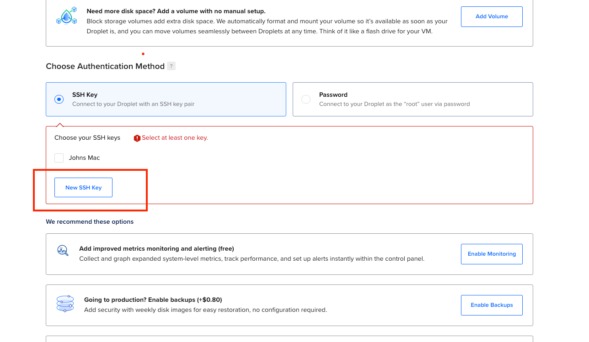
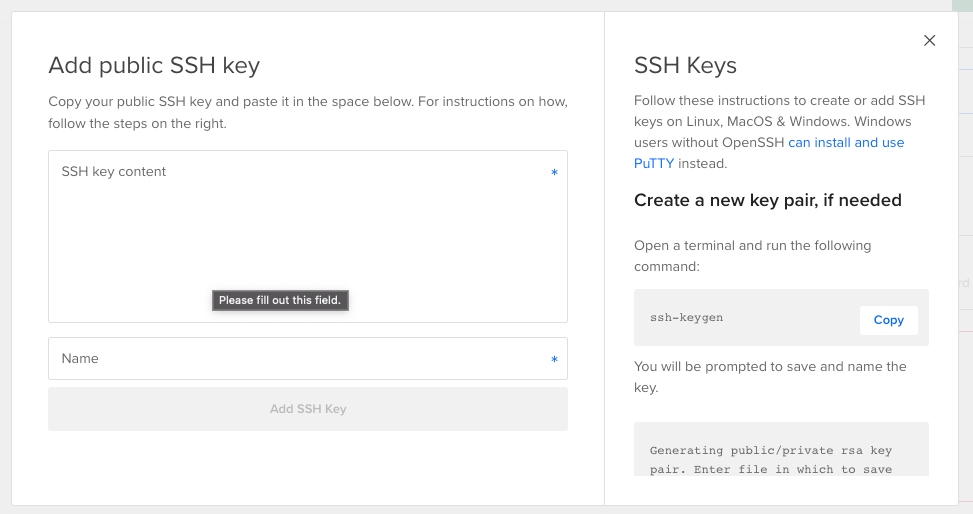
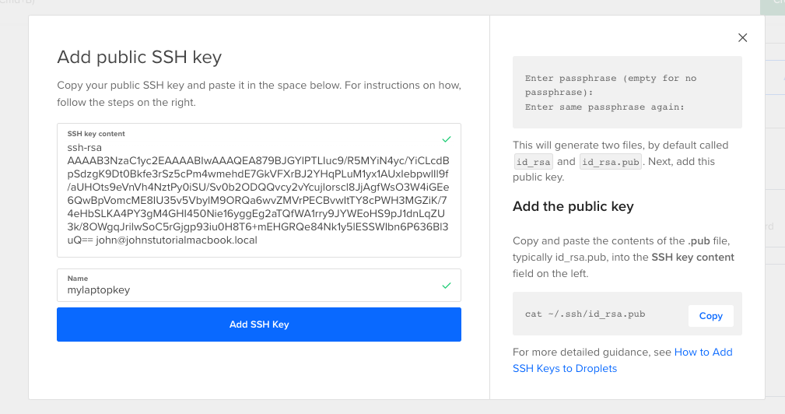
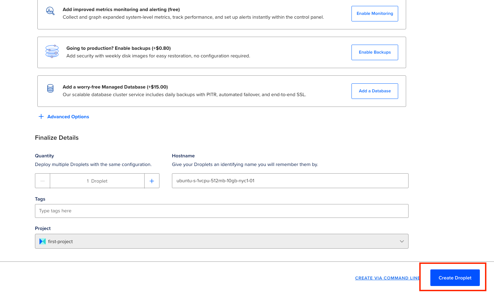

## create a digital ocean droplet

when logged in to your digital ocean account, click on the "create" button near the top right corner.

  
  

here we've selected a local region, the Ubuntu Version 22.04 image, (22.10 is not supported by dokku)  and the most basic $4 a month droplet.  

  
  

be sure to select Ubunto version 22.04, 20.04 or 18.04 because 22.10 is not supported by dokku. We are using version 22.04 for this tutorial.

  
  

under authentication settings, if your SSH keys are already in digital ocean, select them. Otherwise, select "New SSH Key"

  
  

upon clicking "New SSH Key," digital ocean returns a popup with useful instructions on how to add create and retrieve your SSH keys.

  
  

paste your ssh key into the text box labelled "SSH key contents" and click "Add SSH Key"

click "Add SSH Key" and then exit by clicking the little x in the top right corner of the popup.
  
  

click "Create Droplet" and wait for your droplet to be created:

  
  

