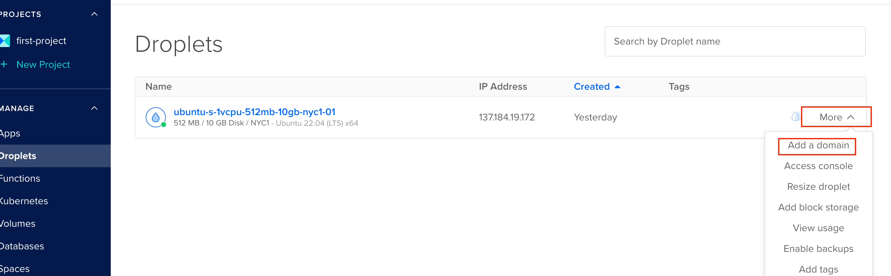
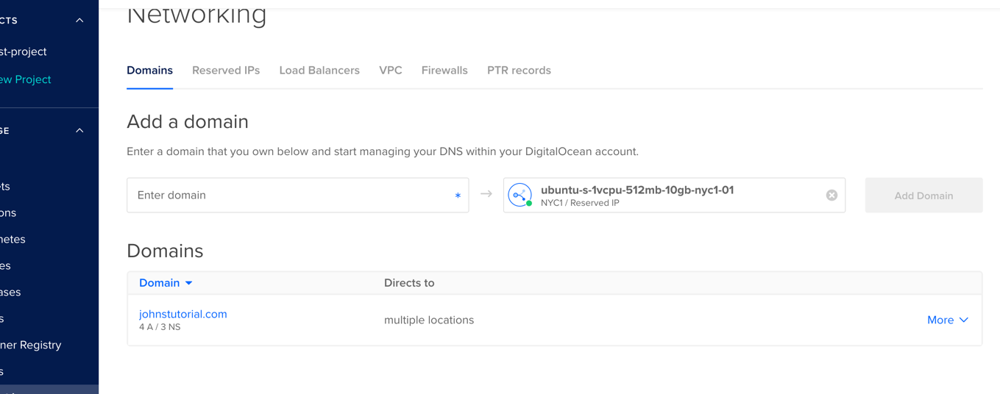
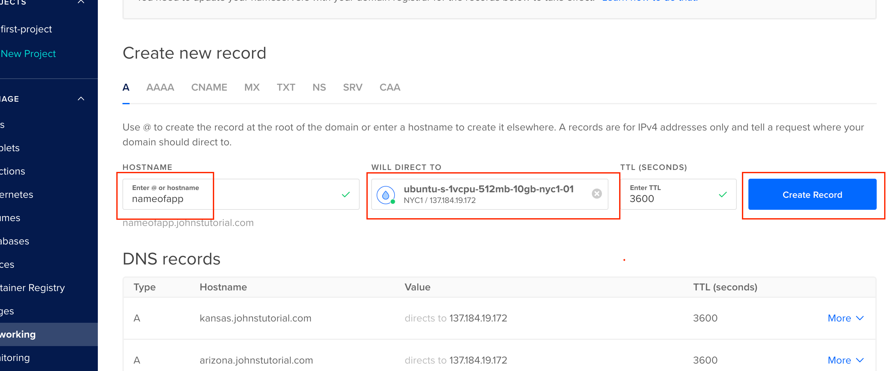

## point URL to dokku app

we want to be able to access our app from the internet, so we need to point our domain name to the dokku app.
  let's add a subdomain to our domain name, and point it to our dokku app.

### add subdomain to domain name
if you're using digitalocean as your DNS manager:

from droplets, click "more" and "add domain"

Either add a domain you own, or click on a domain you've already added to digitalocean's DNS manager
 here, we'll be clicking on 'johnstutorial.com' and add adding a subdomain

### add a DNS record

Add an "A" record, and direct it to your droplet ip address
<a> replace "nameofapp" with your app name or whatever you want to direct to your app"

now traffic to "nameofapp.johnstutorial.com" will be directed to your droplet

