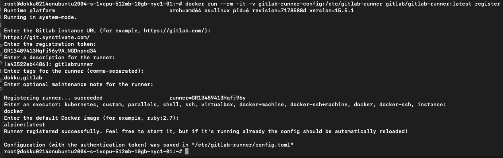

## register a gitlab runner on the server

install gitlab-runner on server by running the following on the server:
```bash
# Download the binary for your system
sudo curl -L --output /usr/local/bin/gitlab-runner https://gitlab-runner-downloads.s3.amazonaws.com/latest/binaries/gitlab-runner-linux-amd64

# Give it permission to execute
sudo chmod +x /usr/local/bin/gitlab-runner

# Create a GitLab Runner user
sudo useradd --comment 'GitLab Runner' --create-home gitlab-runner --shell /bin/bash

# Install and run as a service
sudo gitlab-runner install --user=gitlab-runner --working-directory=/home/gitlab-runner
sudo gitlab-runner start

```

run the following command from the [gitlab docs](https://docs.gitlab.com/runner/register/)

```bash
sudo gitlab-runner register
```

the script will prompt you for your [gitlab url and registration token](get_gitlab_url_and_registration_token.md)
<br>when script prompts `Please enter an executor:`, type `docker` and press enter

<br>when script prompts `Please enter the default Docker image (e.g. ruby:2.7):`<br> type `alpine:latest` and press enter



Now gitlab runner is running in a container on your server. View the status of the runner with the following command:
```bash
sudo gitlab-runner status
```

view all containers on the server with the following command:
```bash
docker ps
```

restart a container with the following command:
```bash
docker restart <first character or two of container name>
```

stop a container with the following command:
```bash
docker stop <first character or two of container name>
```