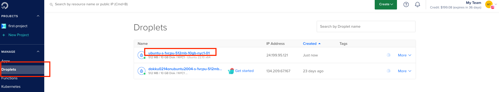
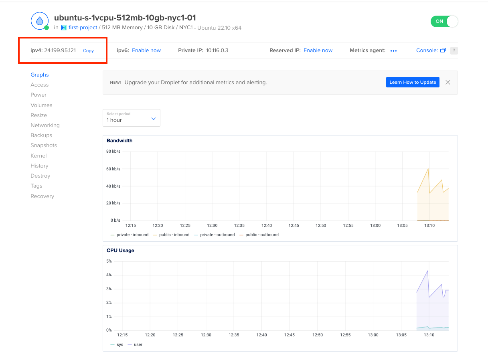
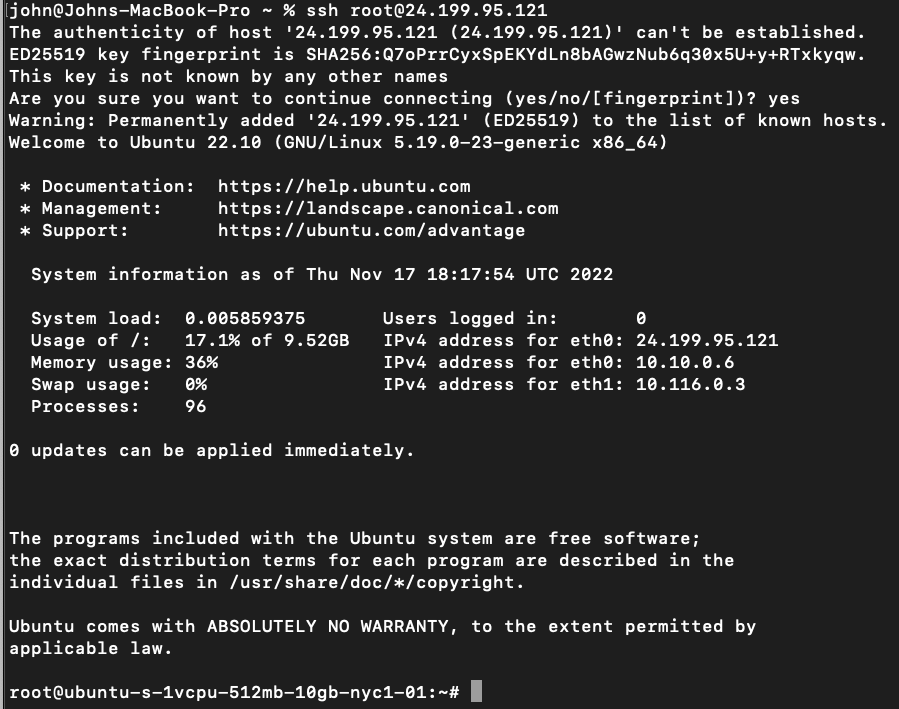

## log into remote server

#### get ip address of new droplet

when signed into digital ocean, select droplets on the left menu and click the link for the newly created droplet

<br/><br/>
<br/><br/>

clicking the link brings you to this page. copy the ip address of the created droplet

<br/><br/>
<br/><br/>


#### log into remote server using copied ip address
```bash
ssh root@[server ip address]
```
<br/><br/>
<br/><br/>



we are now logged into the server remotely


