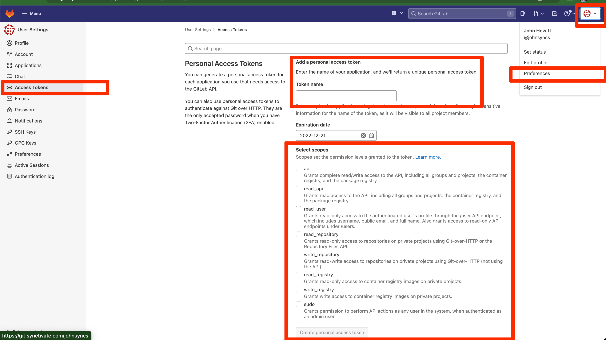

## create a gitlab access token

* in gitlab, click on the user icon in the top right corner of the screen and select "preferences"
* on the left menu select "access tokens"
* name your token
* select the api scopes for the token
   I don't know which scopes are required for this tutorial, but I selected all of them. If you know which scopes are necessary to get the gitlab runner token via api, which is the only reason the script needs it, please put in a pull request with the correct instructions here.

* save the token. you can't retrieve it once you leave the page. If you lose the token, you will have to create a new one.